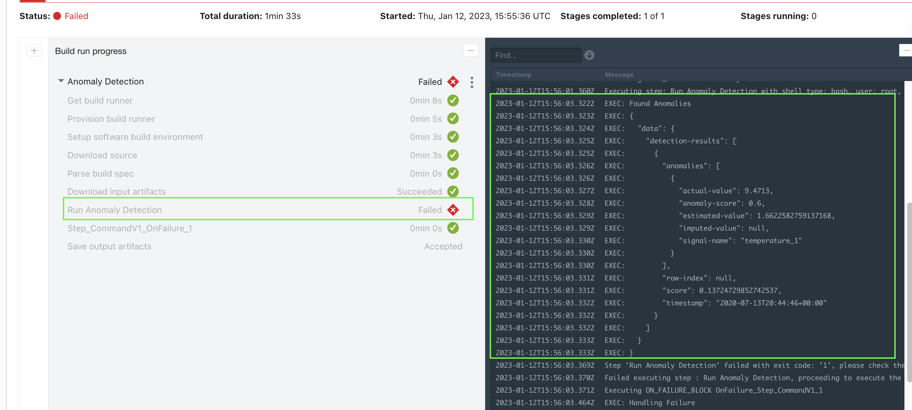
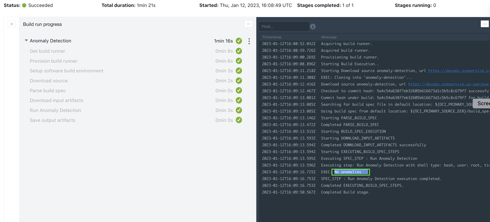

# A sample to run OCI AI Anomaly detection from OCI Build-pipeline.


Objective
---
- Set up an anomaly detection project and pre-trained model.
- Run an anomaly detection from `OCI DevOps build pipeline.
- Make an executive decision based on the anomaly results.

Audience: OCI Advanced or Intermediate Devops / AI users.

Procedure to use the illustration
-------

### OCI Identity policies

- Create an OCI Dynamic group with the below rules.

```java
ALL {resource.type = 'devopsbuildpipeline', resource.compartment.id = 'OCID OF YOUR COMPARTMENT'}
```

- Create an OCI Policy with the below rules.

```java
allow any-user to manage ai-service-anomaly-detection-family in compartment <NAME OF YOUR COMPARTMENT>
allow any user to manage object-family in compartment <NAME OF YOUR COMPARTMENT>
Allow dynamic-group <DYNAMIC GROUP NAME> to manage objects in compartment <NAME OF YOUR COMPARTMENT>
Allow dynamic-group <DYNAMIC GROUP NAME> to manage ai-service-anomaly-detection-family in tenancy
```

### OCI Object storage setup

- Create an object storage bucket.


- Upload the file [demo-training-data.csv](./ai-data-references/demo-training-data.csv) to the bucket.


### OCI Anomaly detection setup

- Create a project under OCI Anomaly detection. - https://docs.oracle.com/en-us/iaas/Content/anomaly/using/create-project.htm


- Under the `project` create a `Data Assets`.Select the `type` as `Oracle Object storage` and select the bucket and the filename.


- Click `Create and Train Model` and create a model. Select the `Data Asset` created in the previous step.


- Provide a name and provide the default FAP and Training ratio and review create the model.


- The details about the various parameters can be found here and it's from one of our Live labs from `Oracle Live Labs` - [Get started with Oracle Cloud Infrastructure Anomaly Detection](https://apexapps.oracle.com/pls/apex/r/dbpm/livelabs/run-workshop?p210_wid=819&p210_wec=&session=107963899615339)

- The creation of the model will take around 10 to 20 minutes.

### OCI DevOps setup

- Create a notification topic - https://docs.oracle.com/en-us/iaas/Content/Notification/Tasks/create-topic.htm#top


- Create a DevOps project - https://docs.oracle.com/en-us/iaas/Content/devops/using/create_project.htm#create_a_project
- Ensure enable logs for the DevOps project.
- Create an `OCI Code repo`


- Push the whole contents here to the OCI CODE REPO created.


- Create an OCI Build pipeline.


- Use `+` and add a new build stage of type `manage build` .Select the `OCI Code repo` created as the `primary buildsoruce`.


- Add a build parameter as `MODEL_OCID` and add the Anomaly detection model's OCID as value.


- Create a `DevOps trigger` and associate `Code repo` and `build a pipeline


### Execution

- The below build stage step is checking anomaly against new data and once an anomaly is detected it will exit. It's a sample build spec with one step, however, this can be extended and altered according to the use cases.

```java
steps:
  - type: Command
    timeoutInSeconds: 6000
    name: "Run Anomaly Detection"
    command: |
      cd ${OCI_PRIMARY_SOURCE_DIR}
      cd ai-data-references
      oci anomaly-detection model detect-anomalies-inline --model-id ${MODEL_OCID} --data file://data.json --signal-names file://signal-names.json >output.json
      counter=`cat output.json|grep -w anomalies`
      if [[ ${counter} != 0 ]]
      then
      echo "Found Anomalies"
      cat output.json
      exit
      fi
      echo "No anomalies"

    onFailure:
```

- The detection is running against the file [data. json](./ai-data-references/data.json)

```java
[
  {
    "timestamp": "2020-07-13T20:44:46Z",
    "values": [ 9.4713, 1, 0.5479, 1.291, 0.8059, 1.393, 0.0293, 0.1541, 0.2611,0.4098]
  },
  {
    "timestamp": "2020-07-13T20:45:46Z",
    "values": [ 0.4713, 1, 0.5479, 1.291, 0.8059, 1.393, 0.0293, 0.1541, 0.2611,0.4098]
  }
]
```

- Refer to the OCI Labs mentioned getting more information about the JSON and methodologies used here.

- Click `Start manual run` with the build pipeline and wait for all the steps to complete.


- Since one of the values `9.4713` in the first data set is exceeding the limit, the check will detect an anomaly and stop proceeding further.




- For the next iteration, update the value of [data. json](./ai-data-references/data.json) to an acceptable limit.

```java
[
  {
    "timestamp": "2020-07-13T20:44:46Z",
    "values": [ 0.4713, 1, 0.5479, 1.291, 0.8059, 1.393, 0.0293, 0.1541, 0.2611,0.4098]
  },
  {
    "timestamp": "2020-07-13T20:45:46Z",
    "values": [ 0.4713, 1, 0.5479, 1.291, 0.8059, 1.393, 0.0293, 0.1541, 0.2611,0.4098]
  }
]
```
- Push the changes back to the code repo. This time the build run will get triggered automatically as we set up the DevOps trigger in the previous DevOps section.


- The execution should follow with a success and with no anomalies.




### Clean up resources (Verify it before and ensure they are  not shared with any other resources before the deletion).

- Remove devops elements using `Devops Project Cascade deletion`

- Delete the bucket content and Bucket.

- Delete Anomaly detection model , data assets and finally project.

- Delete Devops Logs.

- Delete Notification topics.

Read more
---

- OCI DevOps service - https://docs.oracle.com/en-us/iaas/Content/devops/using/home.htm
- Details about OCI Anomaly detection and workshop -.

- There are reference samples available within the directory [ai-data-references](ai-data-references) to set up the anomaly detection project /model and run execution using [OCI CLI](https://apexapps.oracle.com/pls/apex/r/dbpm/livelabs/run-workshop?p210_wid=819&p210_wec=&session=107963899615339).

Contributors
===========

- Author: [Rahul M R](https://github.com/RahulMR42).
- Collaborators:
- Last release: January 2023


